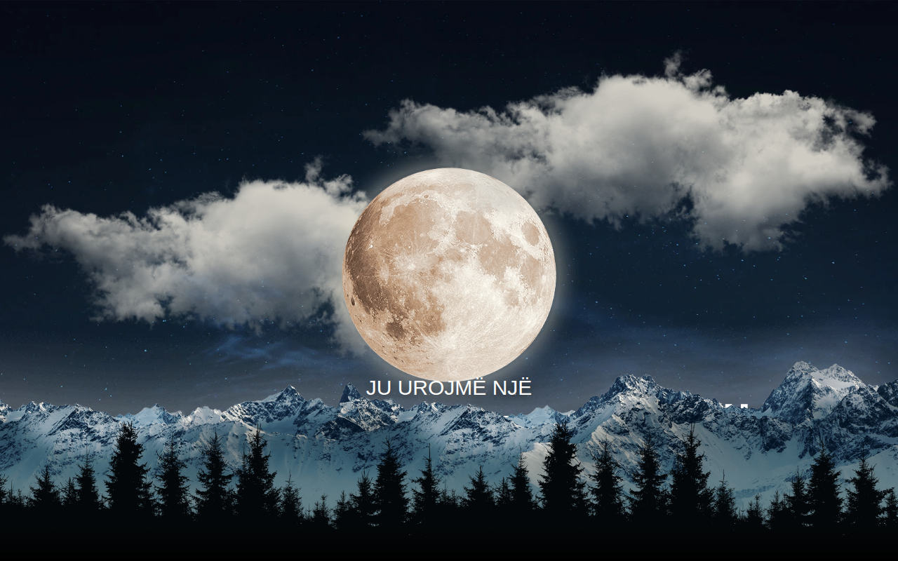

# Noel 🎄

Faqe festive Krishtlindjesh me animacione — urime dhe atmosferë dimri.



## Demo live

👉 https://erionnezha.github.io/Noel/

## Përshkrimi

Një faqe një-faqëshe (one-page) me temë Krishtlindjesh, e përshtatur plotësisht në gjuhën shqipe: seksioni hero me peizazh dimri dhe paralaks, seksioni "rreth nesh", katalog dhuratash, shërbime festive, galeri, formë kontakti, blog dhe footer me të dhënat e kontaktit. Animacionet e shfaqjes (scroll reveal) realizohen me librarinë AOS dhe efekti paralaks në hero me JavaScript.

## Hapja lokalisht

```bash
# Thjesht hapeni index.html në shfletues
# ose shërbejeni me një server statik:
python3 -m http.server 8000
# pastaj hapni http://localhost:8000
```

## Teknologjitë

- HTML5
- CSS3
- JavaScript
- [AOS (Animate On Scroll)](https://michalsnik.github.io/aos/)
- [Font Awesome](https://fontawesome.com/)

## Licenca

Të gjitha të drejtat e rezervuara © 2026 Erion Nezha — shihni [LICENSE](LICENSE).

---

# Noel 🎄 (English)

A festive Christmas landing page with animations — holiday greetings and winter atmosphere.

## Live demo

👉 https://erionnezha.github.io/Noel/

## Description

A one-page Christmas-themed website, fully localized in Albanian: hero section with winter landscape and parallax effect, "about" section, gifts catalog, festive services, gallery, contact form, blog, and a footer with contact details. Scroll-reveal animations are powered by the AOS library, with a JavaScript parallax effect on the hero.

## Run locally

```bash
# Simply open index.html in a browser,
# or serve it with a static server:
python3 -m http.server 8000
# then open http://localhost:8000
```

## Technologies

- HTML5
- CSS3
- JavaScript
- [AOS (Animate On Scroll)](https://michalsnik.github.io/aos/)
- [Font Awesome](https://fontawesome.com/)

## License

All rights reserved © 2026 Erion Nezha — see [LICENSE](LICENSE).

## Author

Erion Nezha
